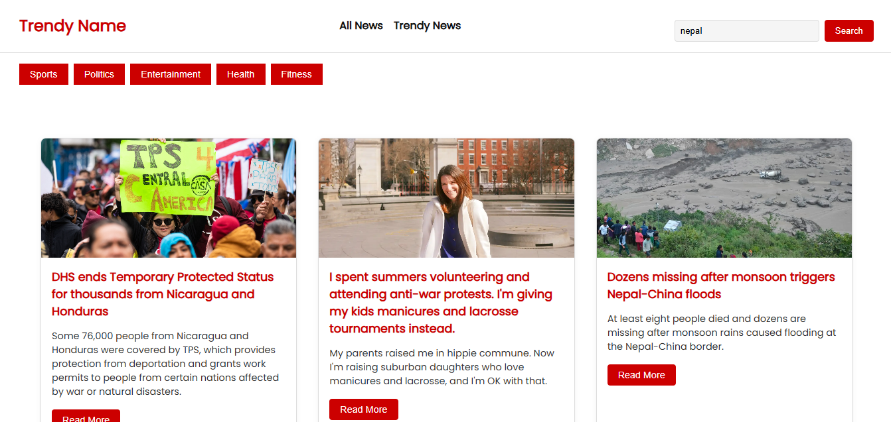

# Trendy News WebApp

A modern and responsive React-based news application that fetches and displays real-time news from the **NewsAPI**. Users can browse trending topics or search for specific news by keyword.

## Features

- Search for news articles by keyword
- Predefined categories: Sports, Politics, Entertainment, Health, Fitness
- Displays image, title, description, and link to full news
- Real-time news fetched from [NewsAPI](https://newsapi.org/)
- Styled with custom CSS

---

## Tech Stack

- React (with Hooks)
- NewsAPI for news data
- CSS for styling

## Folder Structure

```
your-project/
│
├── public/
├── src/
│   ├── Component/
│   │   ├── Card.js
│   │   ├── card.css
│   │   ├── NewsApp.js
│   │   ├── Newspaper.css
│   ├── App.js
│   └── index.js
├── package.json
└── README.md
```

---

## Installation & Setup

1. **Clone the Repository**

   ```bash
   git clone https://github.com/yourusername/news-webapp.git
   cd news-webapp
   ```

2. **Install Dependencies**

   ```bash
   npm install
   ```

3. **Add your NewsAPI Key**

   Replace the placeholder key in `NewsApp.js`:

   ```js
   const API_KEY = "your_api_key_here";
   ```

   > You can get your free API key from [https://newsapi.org](https://newsapi.org).

4. **Run the Development Server**

   ```bash
   npm start
   ```

   The app will open in your default browser at `http://localhost:3000`.

---

## Usage

- Enter a search term in the search bar and click **Search**.
- Or click on any **category button** to filter news.
- Click **Read More** on any card to view the full article in a new tab.

---

## Sample Screenshot


